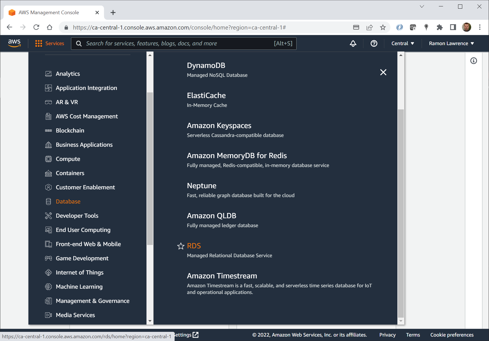

# COSC 516 - Cloud Databases<br/>Lab 1 - MySQL on Amazon RDS

## Setup

Create a Amazon AWS free tier account at: [https://aws.amazon.com/free](https://aws.amazon.com/free).

The free tier account allows for free trials forever and 12-months free offers from your sign up period. You will need an email address to use. The sign-up also asks for a credit card. If you do not have a credit card, then a pre-paid credit card with a small amount should work.

## AWS Console

Login to AWS. In the AWS console, select `Database` then `RDS`.




## Amazon RDS

Click on `Create database`. Select `MySQL` as the engine and `Free tier`. 


For database identifier use `mysql516`. Select a master password for your database. The instance configuration is `db.t3.micro`. Leave storage as `General Purpose SSD`.


For Connectivity, make sure to have public access as `Yes`. Select `Create new VPC` and `DB Subnet Group`. 


Leave database authentication as `Password authentication`. Click `Create database` to create the database.  It may take a few minutes to create the database.


## Configuring VPC and Network Access

In addition to making the database public, you must also configure the database VPC to allow inbound traffic from your machine. A [virtual private cloud (VPC)](https://docs.aws.amazon.com/vpc/latest/userguide/what-is-amazon-vpc.html) is a virtual network that is similar to a physical network. An administrator defines subnets, IP addresses, routing, and firewall information for their VPC. A database instance is created in a particular VPC, and the VPC must be configured to allow network access to it.

Once the databsae is created, click on the database identifier to get to an overview screen. Click on the VPC security group (in the figure it is `default (sg-00bb5776c03caa8c6)`). Then select `Inbound rules`. 


Click on `Edit the inbound rules`. In the next screen, `Add rule` that allows all traffic from your IP address. Only your machine will have access to the database. You can add other rules as required.


## Connecting to the Database

Connecting to the database can be done using MySQL command line or using the MySQL Workbench GUI. For more info, see [Connecting to MySQL on AWS RDS](https://docs.aws.amazon.com/AmazonRDS/latest/UserGuide/USER_ConnectToInstance.html). If you have connection issues, it is most likely related to the VPC configuration (make sure to add your IP for inbound access). AWS provides a [troubleshooting guide](https://docs.aws.amazon.com/AmazonRDS/latest/UserGuide/CHAP_Troubleshooting.html#CHAP_Troubleshooting.Connecting).

### Accessing MySQL using SQuirreL SQL
[SQuirreL](https://squirrel-sql.sourceforge.io/) is an open source graphical query tool capable of querying any JDBC-accessible database including Oracle, MySQL, and SQL Server.

Start up SQuirreL. Register our MySQL server with the information:

```
Name: 516_MySQL
Login name: admin
Password: (password used when created in AWS)
Host name: (see RDS console)
Port: (leave blank for default)
Database: (leave blank)
```


## Tasks

To test your database, write Java code using [Visual Studio Code](https://code.visualstudio.com/). The file to edit is `MySQLonAWS.java`.  The test file is `TestMySQLonAWS.java`.  Fill in the methods requested (search for **TODO**).  Marks for each method are below.  You receive the marks if you pass the JUnit tests AND have followed the requirements asked in the question (including documentation and proper formatting).

- +1 mark - Method `connect()` to make a connection to the database.
- +1 mark - Method `connectSSL()` to make a secure connection to the database. Requires updating database configuration on RDS.
- +1 mark - Method `close()` to close the connection to the database.
- +1 mark - Method `drop()` to drop the tables `company` and `stockprice` that we will be using. Note: The database name will be `lab1`. Note: May need to perform `USE lab1` command before drop. [MySQL USE Command](https://dev.mysql.com/doc/refman/8.0/en/use.html)
- +4 marks - Method `create()` to create the database `lab1`. [MySQL CREATE DATABASE command](https://dev.mysql.com/doc/refman/8.0/en/create-database.html). Create the following tables:
```
	Table name: company
	Fields:
	  - id - integer, must be primary key
	  - name - variable character field up to size 50
	  - ticker - character field always of size 10
	  - annualRevenue - must hold up to 999,999,999,999.99 exactly
	  - numEmployees - integer	 
	 
	Table name: stockprice
	Fields:
	  - companyId - integer
	  - priceDate - date of stock price
	  - openPrice - opening price must hold up to 99999999.99
	  - highPrice - high price must hold up to 99999999.99
	  - lowPrice - low price must hold up to 99999999.99
	  - closePrice - closing price must hold up to 99999999.99
	  - volume - number of shares traded, integer
	  - primary key must be `companyId` and `priceDate`
	  - add an appropriate foreign key
```
- +4 marks - Method `insert()` to add records. The records are given above the `insert()` method in the code file. **You must use PreparedStatements to get full marks.**	

- +1 mark - Write the method `delete()` to delete all stock price records where the date is before `'2022-08-20'` or the company is `'GameStop'`.
- +2 marks - Write the method `query1()` that returns company info (name, revenue, employees) that have more than `10000` employees or annual revenue less that 1 million dollars. Order by company `name` ascending.
- +2 marks - Write the method `query2()` that returns the company name and ticker and calculates the lowest price, highest price, average closing price, and average volume in the week of August 22nd to 26th inclusive.
- +3 marks - Write the method `query3()` that returns a list of all companies that displays their name, ticker, and closing stock price on August 30, 2022 (if exists). Only show companies where their closing stock price on August 30, 2022 is no more than 10% below the closing average for the week of August 15th to 19th inclusive. That is, if closing price is currently 100, the average closing price must be <= 110. Companies without a stock ticker should always be shown in the list. Order by company name ascending.

**Total Marks: 20**

## Bonus Marks: (up to 5)

- +3 bonus marks for configuring multi-AZ fail-over and testing query when have failure (requires not using free-tier). Must also generate a JUnit test to demonstrate.
- +3 bonus marks for creating a read-replica (requires not using free-tier). Create a JUnit test that demonstrates inserting into primary, and after a short delay being able to read the data from the read replica using another connection.
- Up to +3 bonus marks for demonstrating some other unique feature of MySQL on AWS

## Submission

The lab are marked immediately by the professor by showing the output of the JUnit tests and by a quick code review.  Otherwise, submit the URL of your GitHub repository on Canvas. **Make sure to commit and push your updates to GitHub.**

